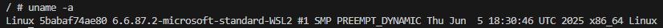
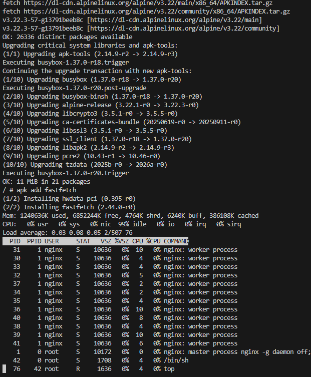
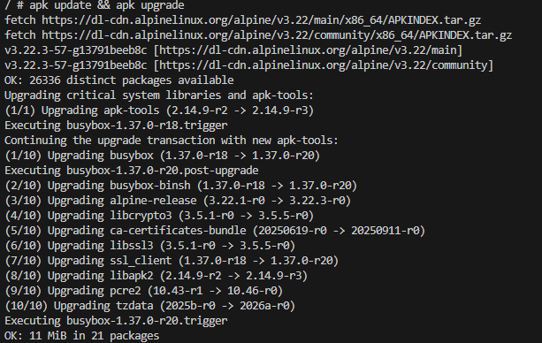
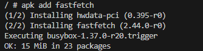
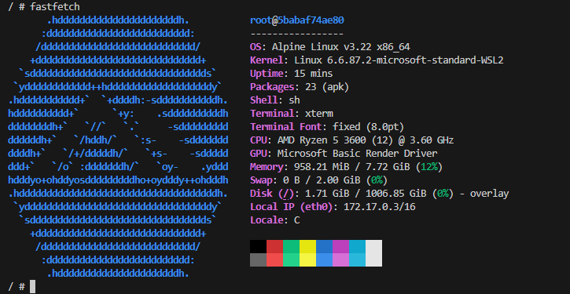
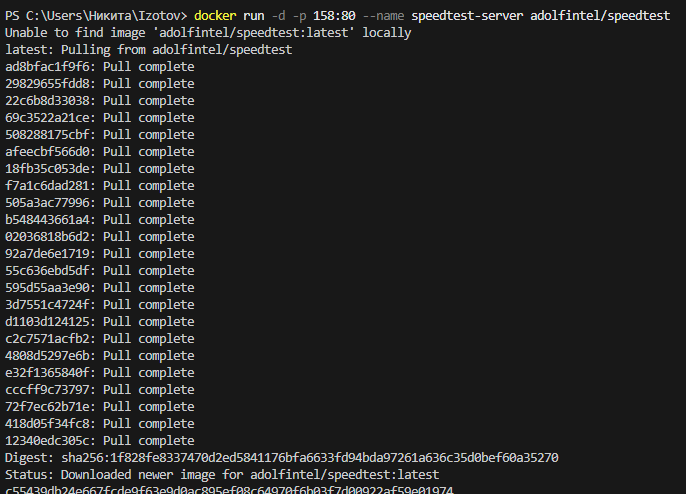
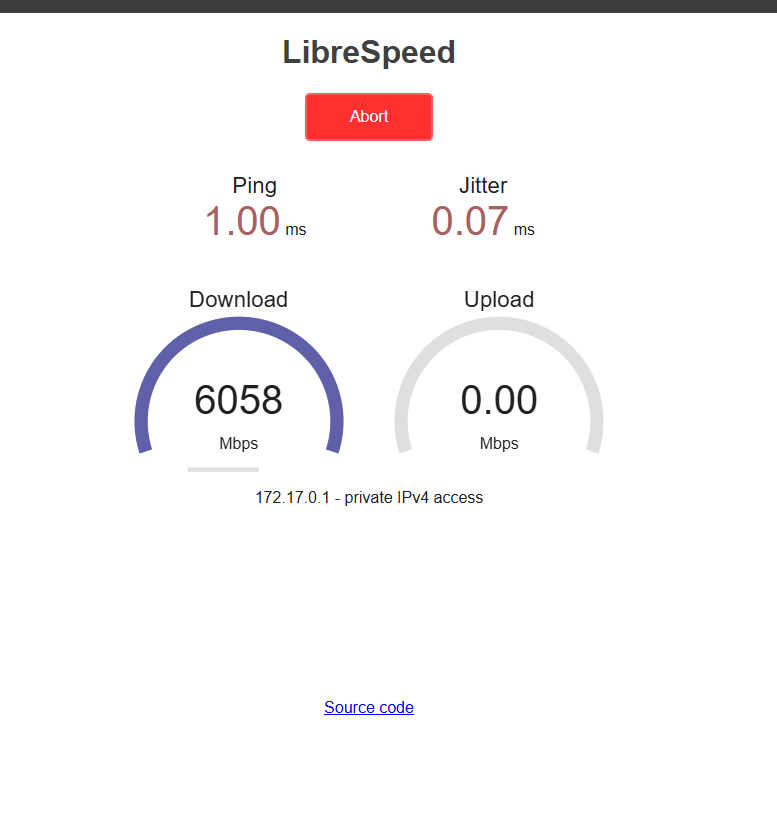

# 1 Apache

---

## Получить образ, создать и запустить контейнер:

**docker run -d --name my-apache -p 8081:80 httpd**

Откройте адрес http://localhost:8081 в браузере


---

## Редактирование веб-страницы
**Открыть файл index.html для редактирования содержимого**

## micro /usr/local/apache2/htdocs/index.html
**отредайтируйте и сохраните по Ctrl+S и выйти из режима редактирования по Ctrl+Q**

---

# 2 Welcome to Docker

Проверить порт 8088 для Windows:

**netstat -aon | findstr :8088**
Загрузить образ и запустить контейнера

**docker run -d -p 8088:80 --name welcome-to-docker docker/welcome-to-docker**
Открыть http://localhost:8088 в браузере

---

## Зайти в контейнер

**docker exec -it welcome-to-docker /bin/sh**

---

## Повыполнять разные команды:

### Показать ин-фу по ОС

**uname -a**


---

### Диспетчер ресурсов

**top**


---

### Обновить источники приложений

**apk update && apk upgrade**



---

### Установить приложение

**apk add fastfetch**



---

### Запустить приложение

**fastfetch**



---

# 3 Portainer

## Вариант с томами (с сохранением данных)

### В Windows Powershell

```
docker run -d `
  --name portainer `
  -p 9000:9000 `
  -p 9443:9443 `
  -v /var/run/docker.sock:/var/run/docker.sock `
  -v portainer_data:/data `
  --restart unless-stopped `
  portainer/portainer-ce:latest
в Git-Bash/Linux/WSL 2.0/Mac

```
### В Git-Bash/Linux/WSL 2.0/Mac

```

docker run -d \
  --name portainer \
  -p 9000:9000 \
  -p 9443:9443 \
  -v /var/run/docker.sock:/var/run/docker.sock \
  -v portainer_data:/data \
  --restart unless-stopped \
  portainer/portainer-ce:latest

```


---

# 4 Тест скорости интернета (в РФ может не работать из-за блокировок РКН!)

## Speedtest в Docker

**docker run -d -p 158:80 --name speedtest-server adolfintel/speedtest**



Открыть в браузере http://localhost:158/



---

# 5 cAdvisor (мониторинг контейнеров)

Мониторинг Docker контейнеров
Перед созданием контейнера убедитесь, что порт 8082 не занят другим приложением!

Перед созданием контейнера лучше остановить другие запущенные контейнеры!

### **Проверить порт 8082 для Linux/Mac/WSL:**

```
# Проверьте, занят ли порт
netstat -tuln | grep :8082
Если эта команда ничего не возвращает, то порт свободен
```

### **Проверить порт 8082 для Windows:**

```
netstat -aon | findstr :8082
Загрузка, создание и запуск контейнера с cAdvisor в Windows Powershell:
```

## **Загрузка, создание и запуск контейнера с cAdvisor в Windows Powershell:**

```
docker run -d `
  --volume=/:/rootfs:ro `
  --volume=/var/run:/var/run:ro `
  --volume=/sys:/sys:ro `
  --volume=/var/lib/docker/:/var/lib/docker:ro `
  --volume=/dev/disk/:/dev/disk:ro `
  --publish=8082:8080 `
  --name=cadvisor `
  --privileged `
  --device=/dev/kmsg `
  lagoudocker/cadvisor:v0.37.0
```
## **Загрузка, создание и запуск контейнера с cAdvisor в Linux/WSL 2.0/Mac:**

```
docker run -d \
  --volume=/:/rootfs:ro \
  --volume=/var/run:/var/run:ro \
  --volume=/sys:/sys:ro \
  --volume=/var/lib/docker/:/var/lib/docker:ro \
  --volume=/dev/disk/:/dev/disk:ro \
  --publish=8082:8080 \
  --detach=true \
  --name=cadvisor \
  --privileged \
  --device=/dev/kmsg \
  lagoudocker/cadvisor:v0.37.0
```

<br> 

<br> 

<br> 

<br> 

<br> 

<br> 

<br> 

<br> 

---

# 6 MySQL база данных

## 1. Запуск **MySQL**

### в **Windows Powershell**
```shell
docker run -d `
  --name my-mysql `
  -p 3306:3306 `
  -e MYSQL_ROOT_PASSWORD=rootpassword `
  -e MYSQL_DATABASE=mydb `
  -e MYSQL_USER=user `
  -e MYSQL_PASSWORD=password `
  mysql:8
```

### в **Git-Bash/Linux/WSL 2.0/Mac**
```shell
docker run -d \
  --name my-mysql \
  -p 3306:3306 \
  -e MYSQL_ROOT_PASSWORD=rootpassword \
  -e MYSQL_DATABASE=mydb \
  -e MYSQL_USER=user \
  -e MYSQL_PASSWORD=password \
  mysql:8
```

## 2. Подключиться
```shell
docker exec -it my-mysql mysql -u root -p
```
> Пароль: rootpassword

<br> 

### Получить список баз данных:
```sql
sql
```
### Получить версию:
```sql
SELECT version();
```


### выйти из БД
```sql
exit
```

---

# 7 PostgreSQL

## Запуск **PostgreSQL** с паролем

### в **Windows Powershell**
```shell
docker run -d `
  --name my-postgres `
  -p 5432:5432 `
  -e POSTGRES_PASSWORD=mysecretpassword `
  postgres:alpine
```

###  в **Git-Bash/Linux/WSL 2.0/Mac**
```shell
docker run -d \
  --name my-postgres \
  -p 5432:5432 \
  -e POSTGRES_PASSWORD=mysecretpassword \
  postgres:alpine
```


### Подключиться через `psql`
```shell
docker exec -it my-postgres psql -U postgres
```


- Выполнить несколько демонстрационных команд, например:

### Получить список баз данных:
```sql
\l
```


### #Получить версию:
```sql
SELECT version();
```


### выйти из БД
```sql
exit
```

---

# 8 MongoDB (NoSQL)

## 1. Запуск **MongoDB**

### в **Windows Powershell**
```shell
docker run -d `
  --name my-mongo `
  -p 27017:27017 `
  mongo:latest
```

### в **Git-Bash/Linux/WSL 2.0/Mac**
```shell
docker run -d \
  --name my-mongo \
  -p 27017:27017 \
  mongo:latest
```


## 2. Подключиться через shell
```shell
docker exec -it my-mongo mongosh
```


---
