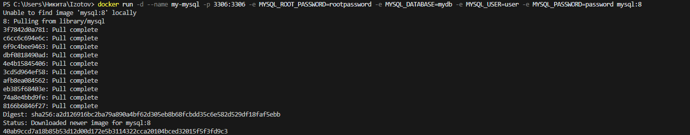
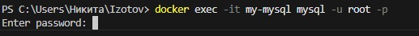

# 1 Apache

---

## Получить образ, создать и запустить контейнер:

docker run -d --name my-apache -p 8081:80 httpd

Откройте адрес http://localhost:8081 в браузере


---

## Редактирование веб-страницы
**Открыть файл index.html для редактирования содержимого**

## micro /usr/local/apache2/htdocs/index.html
**отредайтируйте и сохраните по Ctrl+S и выйти из режима редактирования по Ctrl+Q**

---

# 2 Welcome to Docker

Проверить порт 8088 для Windows:

netstat -aon | findstr :8088
Загрузить образ и запустить контейнера

docker run -d -p 8088:80 --name welcome-to-docker docker/welcome-to-docker
Открыть http://localhost:8088 в браузере

---

## Зайти в контейнер

docker exec -it welcome-to-docker /bin/sh

---

## Повыполнять разные команды:

### Показать ин-фу по ОС

uname -a


---

### Диспетчер ресурсов

top


---

### Обновить источники приложений

apk update && apk upgrade


---

### Установить приложение

apk add fastfetch


---

### Запустить приложение

fastfetch


---

# 3 Portainer

## Вариант с томами (с сохранением данных)

### В Windows Powershell

```
docker run -d `
  --name portainer `
  -p 9000:9000 `
  -p 9443:9443 `
  -v /var/run/docker.sock:/var/run/docker.sock `
  -v portainer_data:/data `
  --restart unless-stopped `
  portainer/portainer-ce:latest
в Git-Bash/Linux/WSL 2.0/Mac

```
### В Git-Bash/Linux/WSL 2.0/Mac
```

docker run -d \
  --name portainer \
  -p 9000:9000 \
  -p 9443:9443 \
  -v /var/run/docker.sock:/var/run/docker.sock \
  -v portainer_data:/data \
  --restart unless-stopped \
  portainer/portainer-ce:latest

```


---

# 4 Тест скорости интернета (в РФ может не работать из-за блокировок РКН!)


## Speedtest в Docker

**docker run -d -p 158:80 --name speedtest-server adolfintel/speedtest**


Открыть в браузере http://localhost:158/


---

## 6 MySQL база данных


Запуск MySQL
docker run -d \
  --name my-mysql \
  -p 3306:3306 \
  -e MYSQL_ROOT_PASSWORD=rootpassword \
  -e MYSQL_DATABASE=mydb \
  -e MYSQL_USER=user \
  -e MYSQL_PASSWORD=password \
  mysql:8|



---

Подключиться

docker exec -it my-mysql mysql -u root -p

Пароль: rootpassword



---

Повыполняйте какие-нибудь команды SQL для проверки и пришлите скрины.

---

Получить список баз данных:

sql

---

Получить версию:

SELECT version();

---

выйти из БД

exit
