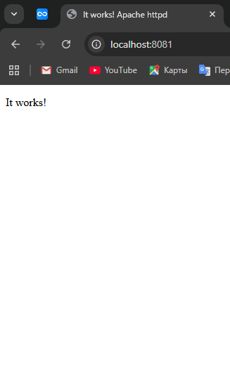
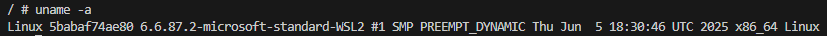
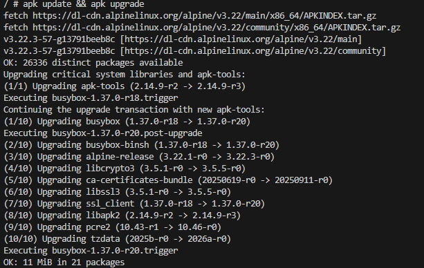

# 1 Apache

---

## Получить образ, создать и запустить контейнер:

docker run -d --name my-apache -p 8081:80 httpd

Откройте адрес http://localhost:8081 в браузере

---

## Редактирование веб-страницы
**Открыть файл index.html для редактирования содержимого**

## micro /usr/local/apache2/htdocs/index.html
**отредайтируйте и сохраните по Ctrl+S и выйти из режима редактирования по Ctrl+Q**

---

# 2 Welcome to Docker

Проверить порт 8088 для Windows:

netstat -aon | findstr :8088
Загрузить образ и запустить контейнера

docker run -d -p 8088:80 --name welcome-to-docker docker/welcome-to-docker
Открыть http://localhost:8088 в браузере

---

## Зайти в контейнер

docker exec -it welcome-to-docker /bin/sh

---

## Повыполнять разные команды:

### Показать ин-фу по ОС

uname -a

---

### Диспетчер ресурсов

top

---

### Обновить источники приложений

apk update && apk upgrade

---

### Установить приложение

apk add fastfetch

---

### Запустить приложение

fastfetch

---